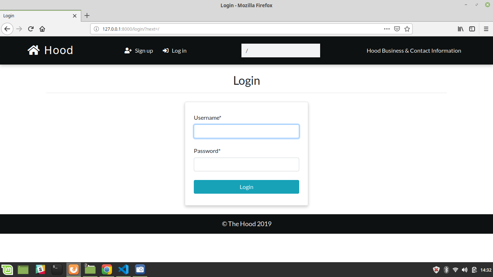
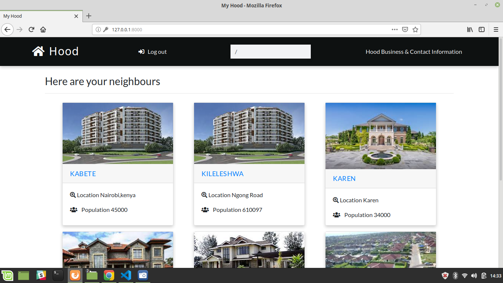
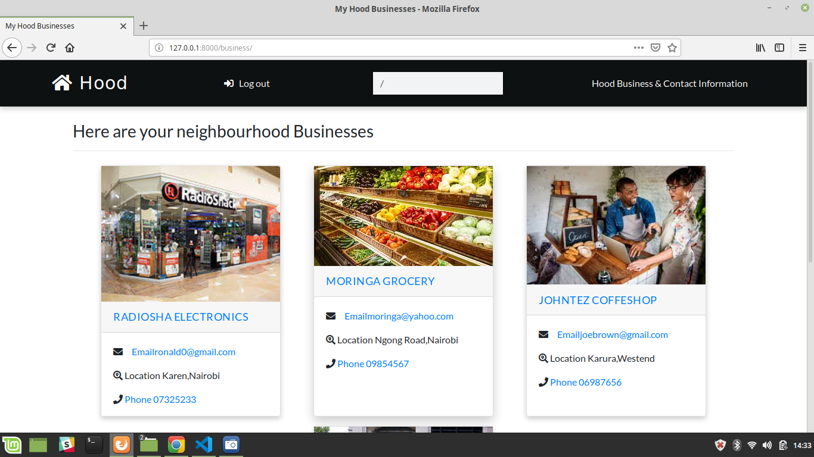
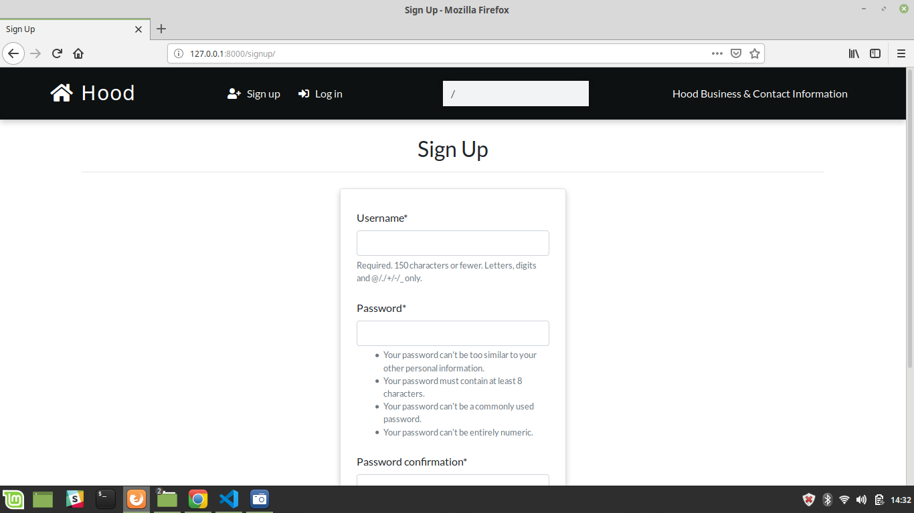
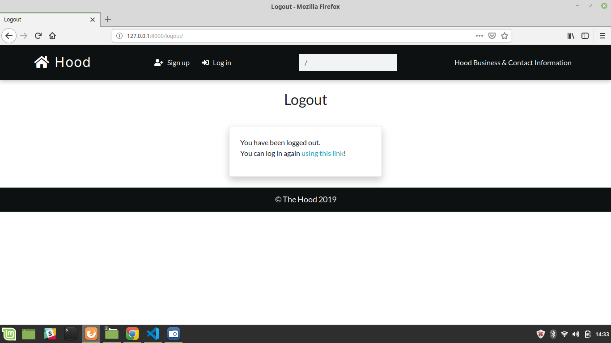

# The Hood

 A web application that allows you to be in the loop about everything happening in your neighborhood.

#### By **Denis Nyamweya**

## The Web Application 

* User Login Page

* Home Page

* The neighbourhood page

* Business page | Business and contacts

* User Signup Page

* User Logout Page

## Description
This is a simple Web Application that showcases different neighborhoods.

## Setup/Installation Requirements
* git clone https://github.com/dennisnyamweya/Neighbourhood.git
* cd  neighbourhood
* Prepare a virtual environment
* Activate a virtual environment on terminal: `source virtual/bin/activate`
* Install all the requirements found in requirements file. 'pip install -r requirements.txt'
* Run applicayion python manage.py runserver
## Behaviour Driven Development(BDD)

| Behaviour | Input | Output |
| :---------------- | :---------------: | ------------------: |
| to add post | click on sign up |  fill in the registration field |
| to intract with app | click on login | fill in the field  and submit |
## Known Bugs
There are no issues that have not yet been resolved and incase of a bug  let users know you know? Outline any issues that would impact use of your application. Share any workarounds that are in place. 

## Technologies Used
* CSS(Bootstrap) for styling.
* HTML for webpage design.
* Crispy forms
* Python3.6.
* Django 2.0

## Support and contact details
 If you run into any issues or have questions, ideas or concerns.Contact me or make a contribution to the code.You can access me via my email denisnyamweya813@gmail.com.Share with me.
### License and Copyright details
* The MIT License [MIT](LICENSE)
* Copyright (c) 2019 **Denis Nyamweya**